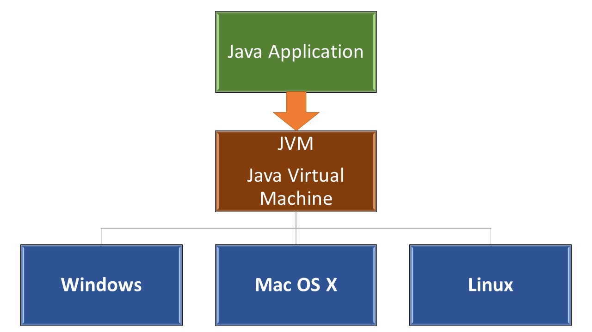
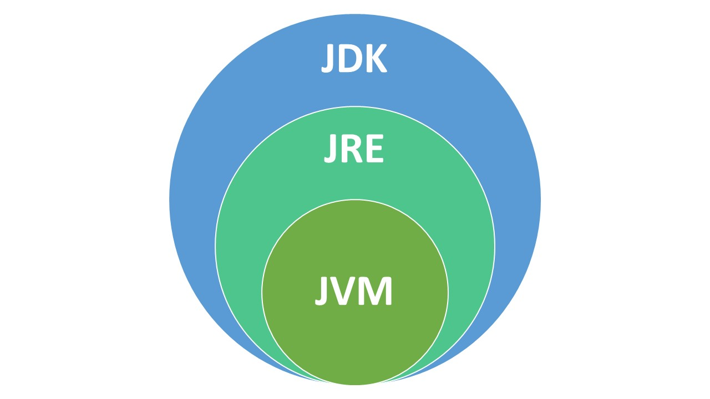
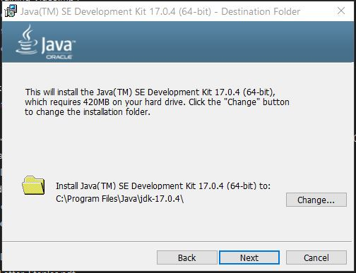
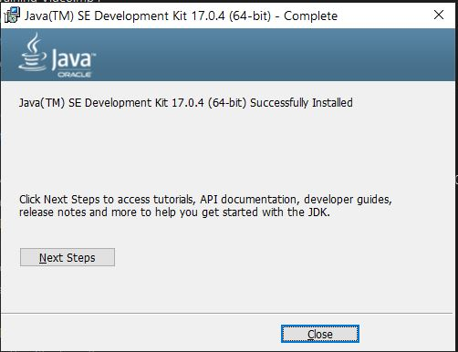
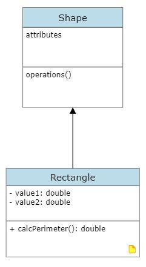

# java-essentials
Learning the essentials of Java Programming Language

# Java
A programming language that was first developed by Sun Microsystems in 1995. Then owned by Oracle.

# Objective
- Installing the required tools to write and run Java programs
- Learning the core concepts of the Java platform
    - JVM
    - JDK
    - JRE

# Java for different platforms:
- Windows Computers:
    - Windows 11
    - Windows 10
    - Windows 7
- Mac Computers:
    - Mac OS X
- Linux Computers (Servers):
    - Ubuntu
    - SuSE
    - Red Hat

# JVM (Java Virtual Machine)
The top level for any computer is the operating system that runs all the other applications, then the "Microprocessor" the hardware. When working with Java, we need to install "JVM" which stands for "Java Virtual Machine". JVM provides a platform-independent way of executing code by abstracting the differences between operating systems and CPU architectures. JVM defines an abstract for a virtual machine that can be mapped to any platform rather than a specific implementation for a real machine or processor, in other words, it allows us to run and execute java applications on any platform. 

Although we have different platforms with different operating systems, we can install the specific JVM version for each platform. So the Java code/program can run in any machine/computer/operating system that has JVM installed on it without having to be rewritten or recompiled by the programmer. This concept is called "WORA" for "Write Once, Run Anywhere".

Like C#, Java is a compiled language (unlike JavaScript or PHP as it's an interpreted language). We write our code using java syntax, then it's tested, debugged, and compiled into something called "Java bytecode" ([Bytecode](https://en.wikipedia.org/wiki/Bytecode) in Wikipedia). JVM takes the bytecode and runs our programs. The syntax/code we write in java is compiled/translated into another format "Java bytecode" in order to be run and executed by JVM. JVM runs this bytecode which means decoding them into machine language and running our Java program and interacting with the low-level aspects and the underlying OS. So JVM can run bytecode in any machine that supports JVM.

By the way, JVM is used for other programming languages JVM language itself and Scala. You can check [the list of JVM languages](https://en.wikipedia.org/wiki/List_of_JVM_languages) (Beyond our topic :-)



# Garbage Collection:
JVM can manage the computer (program) memory automatically in the object life cycle on behalf of the programmer by always checking the memory usage in the heap and stack, which continuously monitor and eliminates unused memory by removing obsolete objects from the memory. This process is called "Garbage Collection".

# JRE (Java Runtime Environment)
In order for the JVM to work it has to be wrapped or run in a run-time environment that supports the Java language. A runtime environment (runtime system) is a sub-system (software) that is designed to run and execute other software exactly as we have to install node.js runtime environment to run JavaScript without the browser. JRE (Java Runtime Environment) is an installation package that provides a runt-time environment for only running java programs/applications on our machines, but not for developing them. So End-users need to install JRE in order to run our java applications. JVM is just a part/component or a subclass of JRE for "Java Runtime Environment". 
So JRE contains:
    - JVM
    - Browser plug-ins for executing Java applets

# JDK (Java Development Kit)
JDK short for "Java Development Kit" is a full-featured software development kit that can be installed by developers/programmers for programming in java language. New Java developers might get confused between JDK and JRE. JDK is a package of tools of Java technology provided by Oracle Corporation in order to build, develop, and run Java-based software, whereas JRE is a package of tools for only running Java programs/applications. If you are not a programmer, you don't need to install JDK? Yes, JDK is used to compile our Java language syntax to bytecode, then JVM which is a subclass of JRE takes the bytecode to convert them to machine language, so to run any Java application, JRE is needed to be installed.

Notice that:
- Developers/programmers need to only install the JDK software package as this package also comes with a complete JRE (usually called a private runtime) that consists of JVM and all of the class libraries, as well as compilers, debuggers, and tools to create programs. 
- JRE does not contain the JDK. JRE is only needed to be installed to run Java Applications on our computers but not for building them.



# IDE (Integrated Development Environment):
IDE is a special tool that we can use as programmers to write our code. We can also write some code using a simple text editor like notepad! Who does that? IDE(s) come with language support and many plugins that make writing our code easier. The IDE uses the JDK to compile and run our java programs. Besides IDE(s), developers can use Code Editors like Visual Studio, Atom, Sublime, etc to write their code.<br>
There are many IDEs to write Java, the most commonly used and popular ones:
- IntelliJ IDEA (category Java development tools)g  written in Java for developing computer software written in Java, Kotlin, Groovy, and other JVM-based languages
- Eclipse (software) (redirect from Eclipse IDE)  second-most-popular IDE for Java development, and, until 2016, was the most popular. Eclipse is written mostly in Java and its primary use is for developing Java applications
- NetBeans (redirect from NetBeans IDE)  NetBeans is an integrated development environment (IDE) for Java. NetBeans allows applications to be developed from a set of modular software components

Remember that all these IDEs are just tools to write your code. The most important part is how confident or good you are in coding with your programming language. A good basketball player can play on any type of court surface: Hardwood, Asphalt, Multi-Purpose, etc. Yes, each type has pros and cons, but lets us focus on our topic "Java" :-)

If your computer is equipped with good hardware specifications, feel free to install any one or all of them for trying. For sure each one, as a dedicated Java IDE, has very good features to make your coding experience easier and faster, but for the purpose of this course, I will use Visual Studio Code from Microsoft :-)

## Visual Studio Code:
- Visual Studio Code: for installing and learning about using VS code check below:
    - [Java in Visual Studio Code](https://code.visualstudio.com/docs/languages/java) by Microsoft.
    - [Working with Java in Visual Studio Code Video](https://youtu.be/ZHHUZyy_fOo) video
    - [Java and VSCode: Tips and Tricks](https://youtu.be/m3SQs3fb_0g) video
    - [LIVE Streamed: Java in VS Code](https://youtu.be/hTHn3Itx7cE) video
NOTE:
You can download
- Coding Pack for Java => download VS Code and JDK
- Extension Pack for Java => download only the extensions (If you already have VS Code installed)
    - [VS Code Extension Pack for Java](https://marketplace.visualstudio.com/items?itemName=vscjava.vscode-java-pack)

# Installing JDK
 - Go to the official website of "Oracle" then [download page](https://www.oracle.com/java/technologies/downloads/)
 - Java SE Development Kit => SE is for Standard Edition and that's what we will install
 - Java 18 and Java 17 are available now:
 - Java 17 LTS is the latest long-term support release for the Java SE platform.
    - JDK 18 will receive updates under these terms, **until September 2022** when it will be superseded by JDK 19
    - JDK 17 will receive updates under these terms, **until at least September 2024**.
 
 You can download version 17 LTS based on your OS. I am using Windows so I can download JDK 17 for Windows. You can read [JDK installation for Windows](https://docs.oracle.com/en/java/javase/17/install/installation-jdk-microsoft-windows-platforms.html#GUID-A7E27B90-A28D-4237-9383-A58B416071CA) follow the step by step instructions:
 - Select Windows => x64 Installer
 - Double click and start the installation, Java will select the default folder for installation. Just click next

- You can close the steps:

- If you click the button "Next Steps", it will take you to [JDK 17 Documentation](https://docs.oracle.com/en/java/javase/17/index.html)
- The JDK will be installed on "C:\Program Files\Java\jdk-17.0.4"

# Set Up a Path Environment Variable
As we do with python, we need to set up the Environment Variable for Java. The concept behind an environment variable is available in all Operating Systems, not only for windows and also not only for Java. This step will provide a place in the memory where the programs can access to get a piece of data they need to share. Env. Vars are variables to enable your operating system to find required Java programs and utilities.
 - Go to the "bin" folder of Java that contains all the tools files that we need to have access to from anywhere. this folder has to be placed in the environment variables list of windows, copy the folder path from the address bar:
    -  C:\Program Files\Java\jdk-17.0.4\bin
- You can access the properties window in many different ways:
    - Right Click "This PC" => Select "Properties" => "Advanced System Setting" on the right side. 
    - In the search box of the taskbar, type "environment...", the application name should appear, click it
- From the system properties window, click "Environment Variables":

- Environment Variable window will appear, you can add the path to the "User Variables for YourName" or the "System Variables" for Windows. If you are the only user, so it has the same effect as the "System Variables" option.
- Two different approaches or ways:
    - FIRST WAY: New Button
        - Click the button "New" then"
            - Variable name:  **JAVA_HOME** 
            - Variable value:and **C:\Program Files\Java\jdk-17.0.4\bin**. You can check this article ["Setting Java variables in Windows"](https://www.ibm.com/docs/en/b2b-integrator/5.2?topic=installation-setting-java-variables-in-windows)
            [new-env-var](images/new-env-var.jpg)
        - After adding the information and clicking "OK", you will see it:
        [new-env-var-added](images/new-env-var-added.jpg)

    - SECOND WAY: Edit Button
        - First click/select the "Path" variable
        - Click "Edit"
        - Click "New", windows will add a new line so just paste the path "C:\Program Files\Java\jdk-17.0.4\bin"
        - Then OK...

    - To verify, open the CMD or terminal from anywhere and type:
        > java --version
        OR:
        > java -version
        You should see:
        java 17.0.4 2022-07-19 LTS
        Java(TM) SE Runtime Environment (build 17.0.4+11-LTS-179)
        Java HotSpot(TM) 64-Bit Server VM (build 17.0.4+11-LTS-179, mixed mode, sharing)

# VS Code and Java
- Open the command Palette (CTRL+SHIFT+P)
- Type => Java: Tips for Beginners

# New Java Project in VS Code:
- Open VS Code
- Open the command Palette (CTRL+SHIFT+P)
- Select > Java: Create Java Project
- Select "No build tools", working with source code directly...
- A new window will appear:
    - Click The folder where you want to create your project and click "Select the project location"
- VS Code will ask you to put the project name. This name will appear in the folder lists and will be the same as the actual folder name.

***I have selected the same folder of my current repo (lecture) which is named "java-essentials" to create a new Java project. VS code created a new folder based on the name I put which is also "Java-Essentials". In a real-life situation, you will have only one folder the actual Java project itself that contains all its files/sub-folders, but for learning and demonstrating, I will leave it as it is:***


The most important folder is "src" where the main code for our Java program is located:
    - Project Folder => "src" Folder => Java Files

Notice that VS code will create App.java as a default file to start our application, I will leave it as it's.
You can learn more about ["Working with Java Projects in VS Code"](https://code.visualstudio.com/docs/languages/java#_working-with-java-projects)

## Setup the Workspace
VS Code Java works directly with folders that have source code. To set up the workspace, simply open a folder using File > Open Folder...

## Create a Class
A program needs an entry and a Java program needs a class to host its entry. To create a class for our quick-start program, Create a File and set its name to Hello.java. In java, most of the .java files are classed, and by convention, we use PascalCase. Run the file and you will see the result!
Now you can put the code in the new file:
```
public class Hello {
    public static void main(String[] args) {
        System.out.println("Hello Java!");
    }
}
```


# Packages
Another important concept to understand, When you start a new project in Java is "Packages". Packages are used to group related classes (Remember that the Java file is called "Class"). When building big applications, we might end up with too many Java files (classes) so it's better to group them under one namespace to avoid any conflict with the variables, and objects that have the same names when many projects are merged together. It's exactly when we create folders on our computers to contain, organize, and separate our files. Dedicated Java IDE like IntelliJ IDEA, NetBeans, or Eclipse will ask you for the project name first and then might give you the option to add the package name at the very beginning when starting a new project, well with IntelliJ, you need to right-click the "src" folder and "New" then "Package". VS Code has extensions that we need to install as mentioned above, and we need to add a package manually by revealing the "JAVA PROJECTS" then Right Click the project name, and selecting "New Package" from the context menu.
A project can have multiple packages to group related classes together under the same folder/category which means under the same package. 

After adding the package, you will see a new folder with the package name you wrote inside the "src" which is the main folder to save our java files:
- Project Folder => "src" Folder => Package Folder => our Java files
- Any java file (Class file) we create, it will start with this line:
    - package *package_name*
    where "package_name" is just whatever name you pick for your package
- By convention, Java packages' names have to be all in to avoid conflict with the names of classes or interfaces. Check [Naming a Package](https://docs.oracle.com/javase/tutorial/java/package/namingpkgs.html#:~:text=Naming%20Conventions,a%20programmer%20at%20example.com%20) in Java docs.

You can read more about Java and packages:
- [Packages-W3Schools] (https://www.w3schools.com/java/java_packages.asp)
- [Java Docs (Packages)](https://docs.oracle.com/javase/tutorial/java/concepts/package.html)
- [All about Java](https://docs.oracle.com/javase/tutorial/java/index.html)
- [CodeCademy](https://www.codecademy.com/learn/learn-java)
- [Object-Oriented Programming Concepts](https://docs.oracle.com/javase/tutorial/java/concepts/index.html)

# My Primary Code files:
To start with, the root folder for Java files which is "src":
 - I have these files:
    - App.java => the default one by VS code
    - HelloJava.java => the very basic one for demo
- I have created a package names "salary_calculator":
    - Reveal the "JAVA PROJECTS" tab of the "EXPLORER" panel
    - Right click on the project that you have created
    - Select/click Package.

# My Packages Order:
Follow the sequence in this chronological order starting from the basic moving to more advanced topics:
1. start (package): contains the following classes:
    - DataType
    - Strings
    - InputOutput
    - ControlFlow

2. basic (package): contains the following classes:
    - StartingPoint
    - PaymentCalculator
    - QuestionAnswer

3. condition_decision (package): contains the following classes:
    - PaymentCalculator
    - GradingSystem
    - GradingMessage
    - LogicalOperator

4. iteration_loops (package): contains the following classes:
    - WhileDoLoop
    - ForLoop
    - NestedBreak

5. methods (package): contains the following classes:
    - MyMethods
    - VariableScope
    - Calculation.java
    - OverloadedMethod.java

6. arrays (package): contains the following classes:
    - MyArray.java
    - ArrayLoop.java
    - MyArrayList.java

7. classes_objects (package): contains the following classes:
    - Rectangle (the basic of creating classes)
    - Student (Constructors)
    - Main
    - WrapperClass
    
8. design_pattern_oop (package): [NOTE: This package is not published on GitHub yet]
    - p1_classes (sub-package):
        - Main.java
        - Person.java
        - User.java
    - p2_coupling (sub-package):
        - Main.java
        - Member.java
        - User.java
    _ p3_interface (sub-package):
        - Main.java
        - other classes...
    _ p4_encapsulation (sub-package):
        - Main.java
        - other classes...
    - p5_abstraction (sub-package):
        -- Main.java
        - other classes...
    - p6_inheritance (sub-package):
        -- Main.java
        - other classes...
    - p7_polymorphism (sub-package):
        -- Main.java
        - other classes...
    - p8_aggregation (sub-package):
        -- Main.java
        - other classes...

9. collections (package): [NOTE: This package is not published on GitHub yet]

10. user_interfaces (package): [NOTE: This package is not published on GitHub yet]
    - Main1
    - Main2
    - Main3

11. user_interface_events (package): [NOTE: This package is not published on GitHub yet]
We will have at least two source code files"
- The main program that has the main() method
- The class file that extends *JFrame class and contains the GUI components

JFrame is the basic window class for a Swing GUI. JFrame can be used in two different ways:
- Attaching GUI components directly to an object/instance of the class JFrame as we did in the previous package
- Extending the JFrame class to create your new custom subclass of JFrame that contain the specific component that are needed for our application


# Working with GUI Application in Java:
The Java Client consists of Java Deployment (Applets and Web Start) and Java UI (Swing, AWT and JavaFX) technologies.

We can develop GUI Applications in Java using:
- JavaFX 
- Abstract Window Toolkit (AWT)
- Swing

For VS Code user, you can check this article ["Working with GUI applications in VS Code"](https://code.visualstudio.com/docs/java/java-gui).

You can check this article about ["Java Client Roadmap Update"](https://www.oracle.com/technetwork/java/javase/javaclientroadmapupdate2018mar-4414431.pdf)


# User Interfaces with Swing
To create Swing Application, we can use and IDE that provides WYSIWYG (What You See Is What You Get) editor to make it easy and faster to arrange the components on the window/frame/panel, or writing or Swing code from scratch. 

Some IDEs comes with WYSIWYG like NetBeans. Without WYSIWYG, we need to use layout our component then adding all the even handling manually.

Most of the Swing GUI components are inherited from "JComponent" and the hierarchy for "JComponent" class:
"JComponent" class = extends => "Container" class = extends => "Component" class = extends => "Object" class

Class JComponent:
- java.lang.Object
    - java.awt.Component
        - java.awt.Container
            - javax.swing.JComponent

The base class for all Swing components except top-level containers. To use a component that inherits from JComponent, you must place the component in a containment hierarchy whose root is a top-level Swing container. Top-level Swing containers -- such as JFrame, JDialog, and JApplet -- are specialized components that provide a place for other Swing components to paint themselves.

You can read more about ["javax.swing - Class JComponent"](https://docs.oracle.com/en/java/javase/17/docs/api/java.desktop/javax/swing/JComponent.html)

## Swing Containers
Swing has a list of top level container that are used to contain the GUI components including JFrame (the one that we will use), JWindow, JDialog, JApplet. All the above containers rely on the "JRootPane". JRootPane manges all Swing containers so it's acting as a container delegate for the top level Swing containers.

These Top-Level containers like our main one "JFrame" has a content pane, like "Panel". Panel is used to contain the visual components of GUI.

Example:
1- JFrame => the top-level container (Represent the GUI window)
2- To add item(s) to the GUI window, we need to add another frame "JPanel"
3- Adding JPanel to the JFrame
4- Adding JComponents (text fields, buttons, list,...) to the JPanel 

NOTES: 
- We can change the order in coding like adding JComponents to the JPanel, then adding JPanel to the JFrame. Or, adding JPanel to the JFrame then adding JComponents to the JFrame, is the same.
- We cannot add JComponents directly to JFrame as the last components will replace all the previous ones, you can see the issue in my code example "Main1.java". So the JComponents have to be added to the "JPanel". 


## Frames and Panels
- After instantiating our frame, we can add one or more panels that contain(s) the GUI components
- Frame can be instantiated with or without a title. The JFrame has two instructors:
    - Empty Constructor
    - A constructor that accept a string to represent the Window/Frame title. Notice that title can be added later also using .setTitle() method for the JFrame object.
- Panel(s), JPanel can be added to the JFrame. Swing Application can have multiple JPanels objects inside the JFrame, but only one JFrame object/instance.
- All our graphical components are being added to the "JPanel"
- JPanel has a default layout called "FlowLayout", the components are being added from left to write and wrap to the next line when they run out room. Think about the "FlowLayout" is like floating all the HTML element to the left inside their container element.

## Jframe
Represents the window itself. all the components of the user interface will be inside this window

## Swing Components
- Swing library has a huge list of components
- All components inherit from the JComponent class
- JComponent class extends the Container class

Check this interesting page ["A Visual Guide to Swing Components"](https://web.mit.edu/6.005/www/sp14/psets/ps4/java-6-tutorial/components.html) from Massachusetts Institute of Technology.

## Layout Managers in Swing
 - Layout Managers are classes that control the size and location of each item of the components inside the container.
 - The default layout is called "FlowLayout" which adds elements from left to right (as discussed above)
 
 Swing provides many different layout managers
 - BorderLayout: Divides the window into five areas: North, South, East, West and Center (the content pane default)
 - BoxLayout: Places/Stacks components in a single row (besides each other) or column (top or each other)
 - CardLayout: Places and manages different/multiple components in a specified area or that share the same display area at different times
 - FlowLayout: Places left to right in a wrapping line/row (the jPanel default)
 - GridBagLayout: Displays components in a grid of cells or in rows and columns; allows components to span cells (rows/columns) and varying sizes
- GridLayout: Places components in a grid of rows and columns or in equally sized rows and columns
- GroupLayout: Places components in horizontal and vertical layout separately
- SpringLayout: Places by relative spacing which is a flexible layout tht emulates all other layouts

# Java AWT (Abstract Window Toolkit)
One of the oldest GUI frameworks in Java. AWT is an API for creating GUI applications in Java. first
[AWT in Wikipedia](https://en.wikipedia.org/wiki/Abstract_Window_Toolkit#:~:text=The%20Abstract%20Window%20Toolkit%20(AWT,GUI)%20for%20a%20Java%20program.)

HINT:
To move Classes between Packages:
- Open the Class File you want to move
- Press CTRL+SHIFT+R
- From the top panel select the package name

You can learn more about ["Moving in VS Code"](https://code.visualstudio.com/docs/java/java-refactoring)

# UML (Unified Modeling Language) Learning Resources based on different UML tools Docs:

- [What is Unified Modeling Language](https://www.lucidchart.com/pages/what-is-UML-unified-modeling-language)
- [UML Class Diagram Tutorial](https://www.lucidchart.com/pages/uml-class-diagram/#discovery__top)
- [What is Unified Modeling Language (UML)?](https://www.visual-paradigm.com/guide/uml-unified-modeling-language/what-is-uml/)
- [UML Class Diagram Relationships Explained with Examples](https://creately.com/blog/diagrams/class-diagram-relationships/#Composition)
- [UML Class Diagram Tutorial](https://www.visual-paradigm.com/guide/uml-unified-modeling-language/uml-class-diagram-tutorial/)
- [What Are The Six Types Of Relationships In UML Class Diagrams?](https://blog.visual-paradigm.com/what-are-the-six-types-of-relationships-in-uml-class-diagrams/)
- [UML Diagram Objects and Their Usage](https://creately.com/blog/diagrams/uml-diagram-objects/)
- [The Unified Modeling Language](https://www.uml-diagrams.org/)

## Classes:
```
public class Vehicle {
    private String type;
    public String owner;
    private int year;

    public void getCarInfo() {

    }
}
```


Notice that the symbol for a "protected" field in the class diagram is #
[UML-Diagrams.org - Class Diagram Domain Image](https://www.uml-diagrams.org/class-diagrams/class-diagram-domain-overview.png)

Relationships Types:
- Inheritance => Rectangle inherits from or extends Shape class
```
public class Rectangle extends Shape {

}
```


- Association refers to the relationship between classes/objects and can be implemented in two different forms: (Composition and Aggregation). [Aggregation & Composition](https://youtu.be/8Jt9crSFd2Q)
    -  Aggregation: Every Computer class has a HardDrive class
- Aggregation with an empty diamond in UML

- Composition with a filled diamond in UML

[The full long list of Software Architecture & Design from Udacity](https://youtube.com/playlist?list=PLAwxTw4SYaPkMTetlG7xKWaI5ZAZFX8fL)
```
public class HardDrive {
    private String hardDriveType; // HDD or SSD
    private String hardDriveBrand; // Seagate, Western Digital...
    private String hardDriveSize; // in GB or in TB
}

public class Computer {
    private String cpu;
    private String ram;
    private HardDrive hardDrive;
}
```


