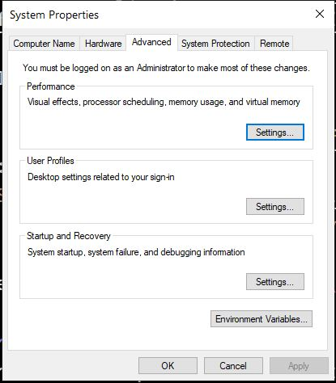

# java-essentials
Learning the essentials of Java Programming Language

# Java
A programming language that was first developed by Sun Microsystems in 1995. Then owned by Oracle.


# Objective
- Installing the required tools to write and run Java programs
- Learning the core concepts of Java platform
    - JVM
    - JDK
    - JRE

# Java for different platforms:
- Windows Computers:
    - Windows 11
    - Windows 10
    - Windows 7
- Mac Computers:
    - Mac OS X
- Linux Computers (Servers):
    - Ununtu
    - SuSE
    - Red Hat

# JVM (Java Virtual Machine)
The top level for any computer is the operating system that runs all the others applications, then the "Microprocessor" the hardware. When working with Java, we need to install "JVM" which is stands for "Java Virtual Machine". JVM provides a platform-independent way of executing code by abstracting the differences between operating systems and CPU architectures. JVM defines an abstract for a virtual machine that can be mapped to any platform rather than specific implementation for a real machine or processor, in other word, it allows us to run and execute java applications in any platform. 

Although, we have different platforms with different operating systems, but we can install the specific JVM version for each platform. So the Java code/program can run in any machine/computer/operating system that has JVM installed on it without having to be rewritten or recompiled by the programmer. This concept is called "WORA" for "Write Once, Run Anywhere".

Like C#, Java is a complied language (unlike JavaScript or PHP as it's an interpreted language). We write our code using java syntax, then it's tested, debugged, and compiled into something called "Java bytecode" ([Bytecode](https://en.wikipedia.org/wiki/Bytecode) in Wikipedia). JVM takes the bytecode and run our programmes. The syntax/code we write in java is compiled/translated into another format "Java bytecode" in order to be run and executed by JVM. JVM runs this bytecode which means decode them into machine language and runs our Java program and interact with the low-level aspects and the underlying of OS. So JVM can run bytecode in any machine that supports JVM.

By the way, JVM is used for other programming languages JVM language itself and Scala. You can check [the list of JVM languages](https://en.wikipedia.org/wiki/List_of_JVM_languages) (Beyond our topic :-)


# Garbage Collection:
JVM can manage the computer (program) memory automatically in the object life cycle on behalf of the programmer by always check the memory usage in the heap and stack, which continuously monitor and eliminates unused memory by removing obsolete objects from the memory. This process is called "Garbage Collection".

# JRE (Java Runtime Environment)
In order for the JVM to work it has to be wrapped or run in a run-time environment that supports Java language. A runtime environment (runtime system) is a sub-system (software) that is designed to run and execute other software exactly as we have to install node.js runtime environment to run JavaScript without the browser. JRE (Java Runtime Environment) is an installation package that provides an runt-time environment for only running java programs/applications on our machines, but not for developing them. So End-users need to install JRE in order to run our java applications. JVM is just a part/component or a subclass of JRE for "Java Runtime Environment". 
So JRE contains:
    - JVM
    - Browser plug-ins for executing Java applets

# JDK (Java Development Kit)
JDK short for "Java Development Kit" which is a full-featured software development kit that can be installed by developers/programmer for programming in java language. New Java developers might get confused between JDK and JRE. JDK is a package of tools of Java technology provided by Oracle Corporation in order to build, develop, and run Java-based software, whereas JRE is a package of tools for only running Java programmes/applications. If you are not a programmer, you don't need to install JDK? Yes, JDK is used to compile our Java language syntax to bytecode, then JVM which is a subclass of JRE takes the bytecode to convert them to machine language, so to run any Java application, JRE is needed to be installed.

Notice that:
- Developers/programmers needs to only install JDK software package as this package also comes with a complete JRE (usually called a private runtime) that consists JVM and all of the class libraries, as well as compilers, debuggers, and tools to create programs. 
- JRE does not contain the JDK. JRE is only needed to be installed to run Java Applications in our computers but not for building them.


# IDE (Integrated Development Environment):
IDE is a special tool that we can use as programmers to write our code. We can also write some code using a simple text editor like notepad! Who does that? IDE(s) come with language support and many plugins that make writing our code easier. The IDE uses the JDK to compile and run our java programs. Beside IDE(s), developers can use Code Editors like Visual Studio, Atom, Sublime, etc to write their code.
- IntelliJ IDEA is an integrated development environment (IDE) by JetBrains and it's written in Java for developing computer software written in Java. You can download the free version which is called "Community Version".
- Visual Studio Code: for installing and learning about using VS code check below:
    - [Java in Visual Studio Code](https://code.visualstudio.com/docs/languages/java) by Microsoft.
    - [Working with Java in Visual Studio Code Video](https://youtu.be/ZHHUZyy_fOo) video
    - [Java and VSCode: Tips and Tricks](https://youtu.be/m3SQs3fb_0g) video
    - [LIVE Streamed: Java in VS Code](https://youtu.be/hTHn3Itx7cE) video
NOTE:
You can download
- Coding Pack for Java => download VS Code and JDK
- Extension Pack for Java => download only the extensions (If you already have VS Code installed)
    - [VS Code Extension Pack for Java](https://marketplace.visualstudio.com/items?itemName=vscjava.vscode-java-pack)

# Installing JDK
 - Go to the official website of "Oracle" then [download page](https://www.oracle.com/java/technologies/downloads/)
 - Java SE Development Kit => SE is for Standard Edition and that's what we will install
 - Java 18 and Java 17 available now:
 - Java 17 LTS is the latest long-term support release for the Java SE platform.
    - JDK 18 will receive updates under these terms, **until September 2022** when it will be superseded by JDK 19
    - JDK 17 will receive updates under these terms, **until at least September 2024**.
 
 You can download version 17 LTS based on your OS. I am using Windows so I can download JDK 17 for Windows. You can read [JDK installation for Windows](https://docs.oracle.com/en/java/javase/17/install/installation-jdk-microsoft-windows-platforms.html#GUID-A7E27B90-A28D-4237-9383-A58B416071CA) follow the step by step instructions:
 - Select Windows => x64 Installer
 - Double click and start the installation, Java will select the default folder for installing. Just click next

- You can close the steps:

- If you click the button "Next Steps", it will take you to [JDK 17 Documentation](https://docs.oracle.com/en/java/javase/17/index.html)
- The JDK will be installed on "C:\Program Files\Java\jdk-17.0.4"

# Set Up a Path Environment Variable
As we do with python, we need to setup the Environment Variable for Java. The concept behind a environment varaible is available in all Operating Systems, not only for windows and also not only for Java. This step will provide a place in the memory where the programs can access to get a piece of data they need to share. Env. Vars are variables to enable your operating system to find required Java programs and utilities.
 - Go to "bin" folder of Java that contains all the tools files that we need to have access to from anywhere. this folder has to be placed in the environment variables list of windows, copy the folder path from the address bar:
    -  C:\Program Files\Java\jdk-17.0.4\bin
- You can access the properties window in many different ways:
    - Right Click "This PC" => Select "Properties" => "Advanced System Setting" on the right side. 
    - In the search box of the taskbar, type "environment...", the application name should appear, click it
- From the system properties window, click "Environment Variables":

- Environment Variable window will appear, you can add the path to the "User Varaibles for YourName" or the "System Varaibles" for Windows. If you are the only user, so it has the same effect as "System Varaibles" option.
- Two different approaches or ways:
    - FIRST WAY: New Button
        - Click the button "New" then"
            - Variable name:  **JAVA_HOME** 
            - Variable value:and **C:\Program Files\Java\jdk-17.0.4\bin**. You can check this article "Setting Java variables in Windows"(https://www.ibm.com/docs/en/b2b-integrator/5.2?topic=installation-setting-java-variables-in-windows)
            [new-env-var](images/new-env-var.jpg)
        - After adding the information and clicking "OK", you will see it:
        [new-env-var-added](images/new-env-var-added.jpg)

    - SECOND WAY: Edit Button
        - First click/select the "Path" varaible
        - Click "Edit"
        - Click "New", windows will add a new line so just paste the path "C:\Program Files\Java\jdk-17.0.4\bin"
        - Then OK...

    - To verify, open the CMD or terminal from any where and type:
        > java --version
        OR:
        > java -version
        You should see:
        java 17.0.4 2022-07-19 LTS
        Java(TM) SE Runtime Environment (build 17.0.4+11-LTS-179)
        Java HotSpot(TM) 64-Bit Server VM (build 17.0.4+11-LTS-179, mixed mode, sharing)

# VS Code and Java
- Open the command Palette (CTRL+SHIFT+P)
- Type => Java: Tips for Beginners

# New Java Project in VS Code:
- Open VS Code
- Open the command Palette (CTRL+SHIFT+P)
- Select > Java: Create Java Project
- Select "No build tools", working with source code directly...
- A new window will appear:
    - Click The folder where you want to create your project and click "Select the project location"
- VS code will ask you to put the project name. This name will appear in the folder lists and will be the same as the actual folder name.

***I have selected the same folder of my current repo (lecture) which is named "java-essentials" to create a new Java project. VS code created a new folder based on the name I put which is also "Java-Essentials". In a real life situation, you will have only one folder the actual Java project itself that contains all its files/sub-folders, but for learning and demonstrating, I will leave as it is:***


The most important folder is "src" where the amin code for our Java program is located:
    - Project Folder => "src" Folder => Java Files

Notice that VS code will create App.java as a default file to start our application, I will leave it as it's.
You can learn more about ["Working with Java Projects in VS Code"](https://code.visualstudio.com/docs/languages/java#_working-with-java-projects)

## Setup the Workspace
VS Code Java works directly with folders that have source code. To setup the workspace, simply open a folder using File > Open Folder...

## Create a Class
A program needs an entry and a Java program needs a class to host its entry. To create a class for our quick-start program, Create a File and set its name to Hello.java. In java, most of .java files are classed and by convention, we use PascalCase. Run the file and you will see the result!
Now you can put the code in the new file:
```
public class Hello {
    public static void main(String[] args) {
        System.out.println("Hello Java!");
    }
}
```

# Packages
Another important concept to understand, When you start a new project in Java are Packages. Packages are used to group related classes (Remember that Java file is called "Class"). When building big applications, we might end up with too many Java files (classes) so it's better group them under one namespace to avoid any conflict with the varaibles, object that have same names when many projects are merged together. It's exactly when we create folders in our computers to contain, organize, and separate our files. Dedicated Java IDE like IntelliJ IDEA, NetBeans, or Eclipse will ask you for the project name first then might give you the option to add the package name at the very beginning when start a new project, well with IntelliJ, you need to right click the "src" folder and "New" then "Package". VS Code has extensions that we need to install as mentioned above, and we need to add a package manually by revealing the "JAVA PROJECTS" then Right Click the project name, and select "New Package" from the context menu.
A project can have multiple packages to group related classes togther under the same folder/category which means under the same package. 

After adding package, you will see a new folder with package name you wrote inside the "src" which is the main folder to save our java files:
- Project Folder => "src" Folder => Package Folder => our Java files
- Any java file (Class file) we create, it will start with this line:
    - package *package_name*
    where "package_name" is just whatever name you pick for your package
- By convention, Java packages' names have to be all in to avoid conflict with the names of classes or interfaces. Check [Naming a Package](https://docs.oracle.com/javase/tutorial/java/package/namingpkgs.html#:~:text=Naming%20Conventions,a%20programmer%20at%20example.com%20) in Java docs.

You can read more about Java and packages:
- [Packages-W3Schools] (https://www.w3schools.com/java/java_packages.asp)
- [Java Docs (Packages)](https://docs.oracle.com/javase/tutorial/java/concepts/package.html)
- [All about Java](https://docs.oracle.com/javase/tutorial/java/index.html)
- [CodeCademy](https://www.codecademy.com/learn/learn-java)
- [Object-Oriented Programming Concepts](https://docs.oracle.com/javase/tutorial/java/concepts/index.html)

# My Primary Code files:
To start with, the root folder for Java files which is "src":
 - I have these files:
    - App.java => the default one by VS code
    - HelloJava.java => the very basic one for demo
- I have created a package names "salary_calculator":
    - Reveal the "JAVA PROJECTS" tab of the "EXPLORER" panel
    - Right click on the project that you have created
    - Select/click Package.

# My Packages Order:
Follow the sequence in this chronological order starting from the basic moving to more advanced topics:
1. start (package): contains the following classes:
    - DataType
    - Strings
    - InputOutput
    - ControlFlow

2. basic (package): contains the following classes:
    - StartingPoint
    - PaymentCalculator
    - QuestionAnswer

3. condition_decision (package): contains the following classes:
    - PaymentCalculator
    - GradingSystem
    - GradingMessage
    - LogicalOperator

4. iteration_loops (package): contains the following classes:
    - WhileDoLoop
    - ForLoop
    - NestedBreak

5. methods (package): contains the following classes:
    - MyMethods
    - VariableScope
    - MyMethods

6. classes_objects (package): contains the following classes:
    - to be added...
    
7. design_pattern_oop (package): [NOTE: This package is not published on GitHub yet]
    - p1_classes (sub-package):
        - Main.java
        - Person.java
        - User.jav
    - p2_coupling (sub-package):
        - Main.java
        - Member.java
        - User.java
    _ p3_interface (sub-package):
        - Main.java
        - other classes...
    _ p4_encapsulation (sub-package):
        - Main.java
        - other classes...
    - p5_abstraction (sub-package):
        -- Main.java
        - other classes...
    - p6_inheritance (sub-package):
        -- Main.java
        - other classes...
    - p7_polymorphism (sub-package):
        -- Main.java
        - other classes...
    - p8_aggregation (sub-package):
        -- Main.java
        - other classes...

HINT:
To move Classes between Packages:
- Open the Class File you want to move
- Press CTRL+SHIFT+R
- From the top panel select the package name

You can learn more about ["Moving in VS Code"](https://code.visualstudio.com/docs/java/java-refactoring)

# UML (Unified Modeling Language) Learning Resources based on different UML tools Docs:

- [What is Unified Modeling Language](https://www.lucidchart.com/pages/what-is-UML-unified-modeling-language)
- [UML Class Diagram Tutorial](https://www.lucidchart.com/pages/uml-class-diagram/#discovery__top)
- [What is Unified Modeling Language (UML)?](https://www.visual-paradigm.com/guide/uml-unified-modeling-language/what-is-uml/)
- [UML Class Diagram Relationships Explained with Examples](https://creately.com/blog/diagrams/class-diagram-relationships/#Composition)
- [UML Class Diagram Tutorial](https://www.visual-paradigm.com/guide/uml-unified-modeling-language/uml-class-diagram-tutorial/)
- [What Are The Six Types Of Relationships In UML Class Diagrams?](https://blog.visual-paradigm.com/what-are-the-six-types-of-relationships-in-uml-class-diagrams/)
- [UML Diagram Objects and Their Usage](https://creately.com/blog/diagrams/uml-diagram-objects/)
- [The Unified Modeling Language](https://www.uml-diagrams.org/)

## Classes:
```
public class Vehicle {
    private String type;
    public String owner;
    private int year;

    public void getCarInfo() {

    }
}
```


Notice that the symbol for a "protected" field in the class diagram is #
[UML-Diagrams.org - Class Diagram Domain Image](https://www.uml-diagrams.org/class-diagrams/class-diagram-domain-overview.png)

Relationships Types:
- Inheritance => Rectangle inherits from or extends Shape class
```
public class Rectangle extends Shape {

}
```


- Association refers to the relationship between classes/object and can be implemented in two different forms: (Composition and Aggregation). [Aggregation & Composition](https://youtu.be/8Jt9crSFd2Q)
    -  Aggregation: Every Computer class has a HardDrive class
- Aggregation with empty diamond in UML

- Composition with filled diamond in UML

[The full long list of Software Architecture & Design from Udacity](https://youtube.com/playlist?list=PLAwxTw4SYaPkMTetlG7xKWaI5ZAZFX8fL)
```
public class HardDrive {
    private String hardDriveType; // HDD or SSD
    private String hardDriveBrand; // Seagate, Western Digital...
    private String hardDriveSize; // in GB or in TB
}

public class Computer {
    private String cpu;
    private String ram;
    private HardDrive hardDrive;
}
```
